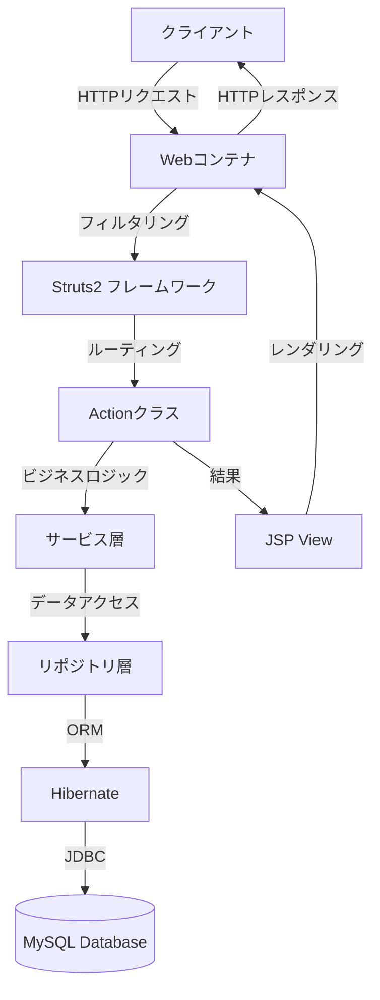
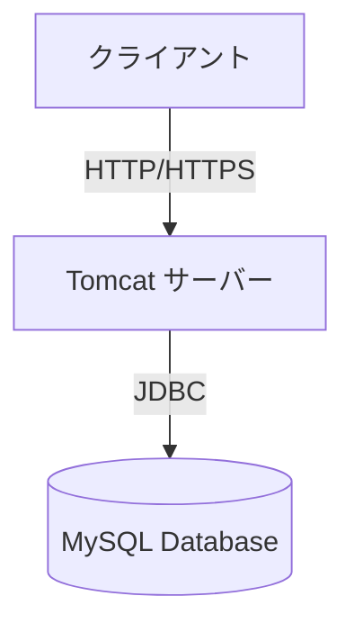

# アーキテクチャ詳細

本システムのアーキテクチャ詳細について説明します。

## 1. アーキテクチャ概要

本システムは、Java EEベースのWebアプリケーションとして実装されており、MVCアーキテクチャパターンに基づいて設計されています。



## 2. 技術スタック詳細

### 2.1 フロントエンド

| 技術/ライブラリ | バージョン | 用途 |
|---------------|----------|------|
| JSP (JavaServer Pages) | 2.3 | ビュー層の実装 |
| JSTL (JSP Standard Tag Library) | 1.2 | JSP内でのタグベースの処理 |
| Bootstrap | 1.6.1 (Struts2 Bootstrap Plugin) | レスポンシブUIフレームワーク |
| jQuery | 3.6.1 (Struts2 jQuery Plugin) | JavaScriptライブラリ |

### 2.2 バックエンド

| 技術/ライブラリ | バージョン | 用途 |
|---------------|----------|------|
| Java | 8 (1.8.0_xxx) | プログラミング言語 |
| Servlet API | 3.0 | サーブレット仕様 |
| Struts 2 | 2.3.15.1 | MVCフレームワーク |
| Hibernate | 4.2.2.Final | ORMフレームワーク |

### 2.3 データベース

| 技術/ライブラリ | バージョン | 用途 |
|---------------|----------|------|
| MySQL | 8.0.33 | リレーショナルデータベース |
| MySQL Connector/J | 8.0.33 | JDBCドライバ |

### 2.4 ビルド・開発環境

| 技術/ライブラリ | バージョン | 用途 |
|---------------|----------|------|
| Ant | 最新版 | ビルド管理ツール |
| Tomcat | 9.x | アプリケーションサーバー |

## 3. アーキテクチャ層の詳細

### 3.1 プレゼンテーション層

プレゼンテーション層は、ユーザーインターフェースとユーザーとのインタラクションを担当します。

#### 主要コンポーネント

- **JSPページ**: ビューの実装
- **Struts2アクション**: コントローラーの役割
- **Struts2インターセプター**: クロスカッティングコンサーン（認証、ロギングなど）の処理

#### 依存関係

- プレゼンテーション層はサービス層に依存
- UIコンポーネントはBootstrapとjQueryに依存

### 3.2 サービス層

サービス層は、ビジネスロジックとトランザクション管理を担当します。

#### 主要コンポーネント

- **サービスクラス**: ビジネスロジックの実装
- **DTOクラス**: データ転送オブジェクト
- **バリデーションロジック**: 入力データの検証

#### 依存関係

- サービス層はリポジトリ層に依存
- トランザクション境界はこの層で定義

### 3.3 リポジトリ層

リポジトリ層は、データアクセスロジックとデータベースとのインタラクションを担当します。

#### 主要コンポーネント

- **リポジトリクラス**: データアクセスロジックの実装
- **エンティティクラス**: データベーステーブルのマッピング
- **クエリ**: データベースクエリの実行

#### 依存関係

- リポジトリ層はHibernateに依存
- エンティティマッピングはHibernateアノテーションとXMLのハイブリッドで定義

### 3.4 データベース層

データベース層は、データの永続化と取得を担当します。

#### 主要コンポーネント

- **MySQL**: リレーショナルデータベース
- **テーブル**: データ構造の定義
- **インデックス**: パフォーマンス最適化

#### 依存関係

- JDBCドライバを通じてJavaアプリケーションと接続
- Hibernateによって抽象化されたアクセス

## 4. 主要なフレームワークの設定

### 4.1 Struts2の設定

Struts2の設定は、`struts.xml`ファイルで管理されており、アノテーションベースの設定を採用しています。

```xml
<?xml version="1.0" encoding="UTF-8"?>
<!DOCTYPE struts PUBLIC
        "-//Apache Software Foundation//DTD Struts Configuration 2.0//EN"
        "http://struts.apache.org/dtds/struts-2.0.dtd">

<struts>
    <constant name="struts.devMode" value="true" />
    <constant name="struts.custom.i18n.resources" value="global" />
    <constant name="struts.i18n.encoding" value="UTF-8" />
    
    <!-- アノテーションベースの設定を有効にする -->
    <constant name="struts.convention.action.packages" value="Project.actions" />
    <constant name="struts.convention.action.suffix" value="Action" />
    <constant name="struts.convention.action.mapAllMatches" value="true" />
    <constant name="struts.convention.default.parent.package" value="struts-default" />
</struts>
```

### 4.2 Hibernateの設定

Hibernateの設定は、`hibernate.cfg.xml`ファイルで管理されています。

```xml
<?xml version='1.0' encoding='utf-8'?>
<!DOCTYPE hibernate-configuration PUBLIC
    "-//Hibernate/Hibernate Configuration DTD//EN"
    "http://www.hibernate.org/dtd/hibernate-configuration-3.0.dtd">
<hibernate-configuration>
  <session-factory>
    <property name="dialect">org.hibernate.dialect.MySQLDialect</property>
    <property name="connection.url">jdbc:mysql://localhost:3306/Project</property>
    <property name="connection.driver_class">com.mysql.jdbc.Driver</property>
    <property name="connection.username">root</property>
    <property name="connection.password"></property>
    <mapping resource="Project/model/CourseDetails.hbm.xml"/>
    <mapping class="Project.model.CourseDetails"/>
    <mapping resource="Project/model/RegisteredCourses.hbm.xml"/>
    <mapping class="Project.model.RegisteredCourses"/>
    <mapping resource="Project/model/Transcript.hbm.xml"/>
    <mapping class="Project.model.Transcript"/>
    <mapping class="Project.model.User"/>
    <mapping resource="Project/model/User.hbm.xml"/>
  </session-factory>
</hibernate-configuration>
```

### 4.3 Webアプリケーション設定

Webアプリケーションの設定は、`web.xml`ファイルで管理されています。

```xml
<?xml version="1.0" encoding="UTF-8"?>
<web-app xmlns:xsi="http://www.w3.org/2001/XMLSchema-instance" xmlns="http://java.sun.com/xml/ns/javaee" xmlns:web="http://java.sun.com/xml/ns/javaee/web-app_2_5.xsd" xsi:schemaLocation="http://java.sun.com/xml/ns/javaee http://java.sun.com/xml/ns/javaee/web-app_3_0.xsd" id="WebApp_ID" version="3.0">
  <display-name>StudentEnrollmentWithStruts</display-name>
  <filter>
          <filter-name>struts2</filter-name>
          <filter-class>org.apache.struts2.dispatcher.ng.filter.StrutsPrepareAndExecuteFilter</filter-class>
  </filter>
  <filter-mapping>
          <filter-name>struts2</filter-name>
          <url-pattern>/*</url-pattern>
  </filter-mapping>
  
  <filter>
    <filter-name>encodingFilter</filter-name>
    <filter-class>org.apache.catalina.filters.SetCharacterEncodingFilter</filter-class>
    <init-param>
      <param-name>encoding</param-name>
      <param-value>UTF-8</param-value>
    </init-param>
    <init-param>
      <param-name>forceEncoding</param-name>
      <param-value>true</param-value>
    </init-param>
  </filter>
  <filter-mapping>
    <filter-name>encodingFilter</filter-name>
    <url-pattern>/*</url-pattern>
  </filter-mapping>
</web-app>
```

## 5. デプロイメント構成

### 5.1 アプリケーションサーバー構成

本システムは、Apache Tomcat 9.x上で動作するように設計されています。



### 5.2 ビルド構成

プロジェクトはAntを使用してビルドされます。主なビルドタスクは以下の通りです：

```
build.xml
├── clean - ビルドディレクトリをクリーンアップ
├── init - ビルドディレクトリを初期化
├── compile - Javaソースのコンパイル
├── war - WARファイルの作成
└── deploy - Tomcatへのデプロイ
```

### 5.3 ファイル構成

アプリケーションのデプロイメントファイル構成は以下の通りです：

```
StudentManagementSystem.war
├── META-INF/
│   └── MANIFEST.MF
├── WEB-INF/
│   ├── classes/
│   │   └── Project/
│   │       ├── actions/
│   │       ├── model/
│   │       ├── repository/
│   │       ├── service/
│   │       └── util/
│   ├── lib/
│   │   ├── struts2-core-2.3.15.1.jar
│   │   ├── hibernate-core-4.2.2.Final.jar
│   │   └── ... (その他の依存ライブラリ)
│   ├── struts.xml
│   └── web.xml
├── index.jsp
├── css/
│   └── ... (CSSファイル)
├── js/
│   └── ... (JavaScriptファイル)
└── ... (その他の静的リソース)
```

## 6. パフォーマンスと拡張性

### 6.1 パフォーマンス最適化

本システムでは、以下のパフォーマンス最適化を実施しています：

1. **データベース最適化**
   - インデックス設計
   - クエリ最適化

2. **アプリケーション最適化**
   - Hibernateのマッピング最適化
   - 静的リソースのキャッシュ

3. **フロントエンド最適化**
   - CSS/JSの最適化
   - 非同期ローディング

### 6.2 拡張性設計

本システムは、将来の拡張を考慮して以下の設計を採用しています：

1. **モジュール化**
   - 層ごとの明確な責任分担
   - 疎結合な設計

2. **スケーラビリティ**
   - ステートレスなアプリケーション設計

3. **拡張ポイント**
   - アノテーションベースの設定
   - コンベンションオーバーコンフィグレーション 