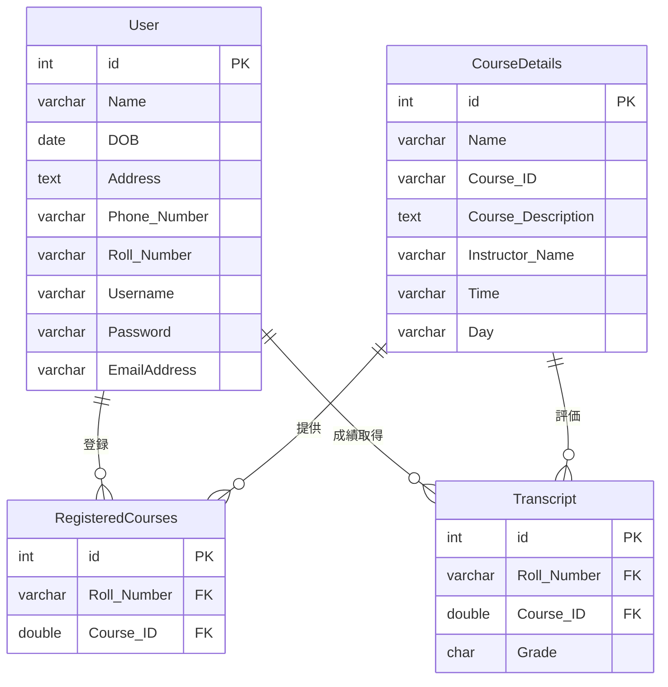

# 学生管理システムER図

```mermaid
erDiagram
    User {
        int id PK
        varchar Name
        date DOB
        text Address
        varchar Phone_Number
        varchar Roll_Number
        varchar Username
        varchar Password
        varchar EmailAddress
    }
    
    CourseDetails {
        int id PK
        varchar Name
        varchar Course_ID
        text Course_Description
        varchar Instructor_Name
        varchar Time
        varchar Day
    }
    
    RegisteredCourses {
        int id PK
        varchar Roll_Number FK
        double Course_ID FK
    }
    
    Transcript {
        int id PK
        varchar Roll_Number FK
        double Course_ID FK
        char Grade
    }
    
    User ||--o{ RegisteredCourses : "登録"
    CourseDetails ||--o{ RegisteredCourses : "提供"
    User ||--o{ Transcript : "成績取得"
    CourseDetails ||--o{ Transcript : "評価"
``` 